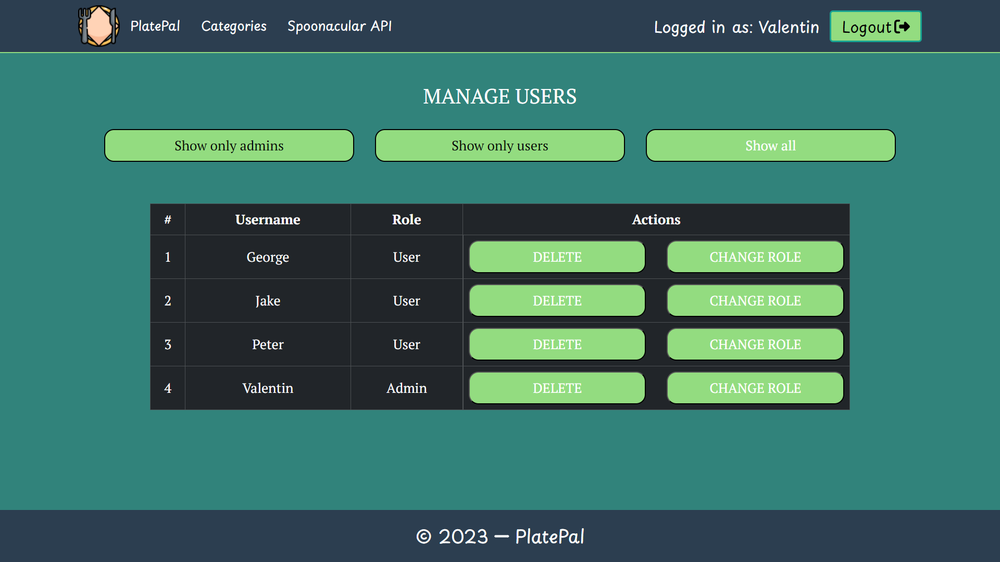

# PlatePal

PlatePal is a MERN (MongoDB, Express.js, React, Node.js) stack web application for managing recipes. Whether you're a cooking enthusiast or someone looking for meal ideas, PlatePal has you covered. Create, share, and explore delicious recipes with our community.

## Tech Stack

### Client
- React
- React-Bootstrap
- React-Router
- React-Hook-Form

### Server
- NodeJS
- Express
- MongoDB
- Mongoose
- Multer
- Cloudinary
- Bcrypt
- JsonWebToken

## Restrictions
### Guest
- Cannot create a recipe
- Cannot edit a recipe
- Cannot delete a recipe
- Cannot star a recipe
- Cannot add a recipe to favorites
- Cannot post a comment
- Cannot edit a comment
- Cannot delete a comment
- Cannot like a comment
- Cannot change username or password

### User
- Cannot approve a recipe
- Cannot manage users

## Run Locally

Clone the project

```bash
  git clone https://github.com/vvalentinov/PlatePal
```

Go to the client project directory

```bash
  cd client
```

Install dependencies

```bash
  npm install
```

Start the client app

```bash
  npm run dev
```
Go to the server project directory

```bash
  cd server
```

Install dependencies

```bash
  npm install
```

Start the server app

```bash
  npm start
```

## Screenshots

### Home Page


### Create Recipe Section


### Most Recent Recipes


### Top Rated Recipes


### Create Recipe Page


### Edit Recipe Page


### All Categories Page


### Recipe Details Page


### Recipe Comment Section


### My Profile Page


### Manage Users Page


## License

This project is licensed under the MIT License - [MIT](https://choosealicense.com/licenses/mit/).